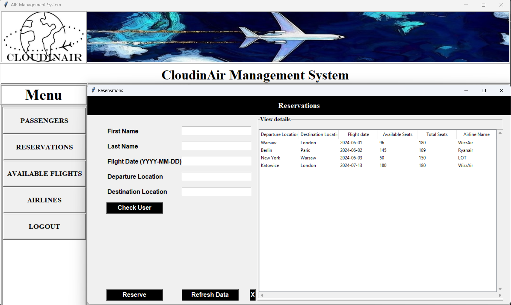

# CloudinAir - Air Management System

### Project Description
CloudinAir Management System is a Python-based application designed to manage flight bookings, customer data, and account management for a travel agency or airline. The system offers essential functionalities such as user registration, login, password recovery, flight reservations, and customer management. The application is equipped with an intuitive graphical user interface (GUI) built using Tkinter, and it connects to an SQL database to store and manage customer and flight information.

### Technologies
Programming Language: *Python 3.x* 

Libraries and Frameworks:
- Tkinter: For building the graphical user interface.
- MySQL: For managing and storing customer and flight data.

### Features

1) Registration for new users with password storage.

2) Login functionality with authentication.

3) Password recovery via a unique code for reset if forgotten.

4) Customer Management:
- Add new customers to the database.
- Modify customer data, such as personal information and contact details.
- Delete customers who have not shown activity for a prolonged period.

5) Flight Management:

- Full flight booking system for customers.
- Manage flight details, including available dates, destinations, and seats.
- Ability to view and reserve flights for customers.

